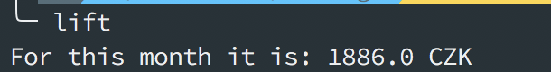

# Liftago CLI for monthly spending

Script check your gmail account and shows you how much you spend on liftago this month.

It is mostly quickstart of google gmail script with simple query.

## Start up

- You need to allow read rights to your gmail -> Step 1 from [google quickstart](https://developers.google.com/gmail/api/quickstart/python)

- Prepare your virtual environment in your working directory

```bash
python3 -m venv venv

source ./venv/bin/activate

pip install -r requirements.txt
```

- create alias in your

```bash
echo 'alias lift="$HOME/Code/liftago_gmail_count/venv/bin/python $HOME/Code/liftago_gmail_count/liftago.py"' >> $HOME/.zshrc
```

## Example


